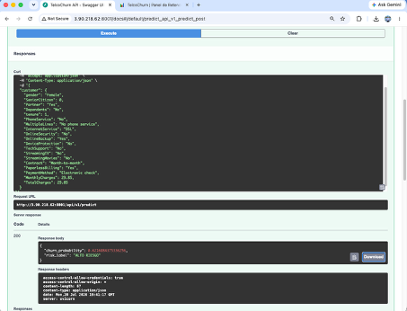
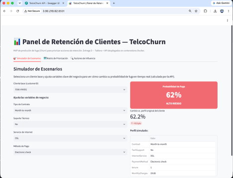

# Manual de Instalación — TelcoChurn (API + Tablero)

Este manual describe cómo instalar y desplegar la solución completa (`churn-api` + `churn-tablero`) usando Docker. Aplica tanto para una instalación local como para una máquina virtual en la nube (AWS EC2), que es donde se encuentra desplegada la instancia de referencia de esta entrega.

## 1. Prerrequisitos

- Una máquina Linux (recomendado: Ubuntu 24.04) o macOS/Windows con Docker instalado.
- Docker Engine y el plugin `docker compose` (v2).
- Python 3.12 y `pip` (solo para el paso de generación del modelo, no para correr los contenedores).
- Acceso al repositorio Git: `https://github.com/fduarteg2/ProjectChurn`
- Credenciales temporales de AWS (AWS Academy Learner Lab) con permisos de lectura sobre el bucket S3 `projectchurn-dvc-fduarteg2` (remoto de DVC), únicamente necesarias para descargar el dataset versionado.

## 2. Clonar el repositorio

```bash
git clone https://github.com/fduarteg2/ProjectChurn.git
cd ProjectChurn
```

## 3. Instalar Docker (si la máquina no lo tiene)

```bash
sudo apt-get update
sudo apt-get install -y ca-certificates curl gnupg
sudo install -m 0755 -d /etc/apt/keyrings
curl -fsSL https://download.docker.com/linux/ubuntu/gpg | sudo gpg --dearmor -o /etc/apt/keyrings/docker.gpg
sudo chmod a+r /etc/apt/keyrings/docker.gpg
echo \
  "deb [arch=$(dpkg --print-architecture) signed-by=/etc/apt/keyrings/docker.gpg] https://download.docker.com/linux/ubuntu \
  $(. /etc/os-release && echo "$VERSION_CODENAME") stable" | sudo tee /etc/apt/sources.list.d/docker.list > /dev/null
sudo apt-get update
sudo apt-get install -y docker-ce docker-ce-cli containerd.io docker-buildx-plugin docker-compose-plugin
```

## 4. Generar el modelo empaquetado y el dataset limpio

El modelo (`modelo_churn_final.joblib`) y el dataset limpio (`telco_churn_clean.csv`) que consumen los contenedores **no están versionados en Git** (son artefactos generados). Se regeneran localmente a partir del dataset versionado en DVC:

```bash
sudo apt-get install -y python3-pip python3-venv
python3 -m venv venv
source venv/bin/activate
pip install --upgrade pip
pip install -r requirements_local.txt
```

Configure las credenciales temporales de AWS (solo necesarias para este paso):

```bash
export AWS_ACCESS_KEY_ID="<su_access_key>"
export AWS_SECRET_ACCESS_KEY="<su_secret_key>"
export AWS_SESSION_TOKEN="<su_session_token>"
```

Descargue el dataset y entrene el modelo final:

```bash
dvc pull
python train_final_model.py
```

Al finalizar debe existir en la raíz del repositorio: `modelo_churn_final.joblib` y `telco_churn_clean.csv`.

## 5. Construir y levantar los contenedores

```bash
sudo docker compose build
sudo docker compose up -d
```

Esto construye dos imágenes:

- **churn-api**: FastAPI + el modelo empaquetado, puerto **8001**.
- **churn-tablero**: Streamlit, puerto **8501**, configurado para llamar a `churn-api` por red interna de Docker (variables de entorno `API_URL=churn-api`, `API_PORT=8001`).

## 6. Verificar la instalación

```bash
sudo docker compose ps
sudo docker compose logs --tail=50
```

Ambos servicios deben aparecer con estado `Up`. Luego, desde un navegador:

- API (documentación interactiva): `http://<IP_DE_LA_MAQUINA>:8001/docs`
- Tablero: `http://<IP_DE_LA_MAQUINA>:8501`

Si la API responde correctamente, en `/docs` debe verse el Swagger UI con los endpoints disponibles, y al probar `POST /api/v1/predict` debe recibir una respuesta `200` con `churn_probability` y `risk_label`:



Y el tablero debe cargar sus 3 pestañas sin mensajes de error de conexión:



## 7. Apertura de puertos (si se despliega en AWS EC2)

En el Security Group de la instancia EC2, habilite reglas de entrada (Inbound rules) para:

- TCP 22 (SSH) — desde su IP o "Anywhere" para administración.
- TCP 8001 (API) — "Anywhere IPv4" (0.0.0.0/0).
- TCP 8501 (Tablero) — "Anywhere IPv4" (0.0.0.0/0).

## 8. Detener / reiniciar

```bash
sudo docker compose down       # detiene y elimina los contenedores (conserva las imagenes)
sudo docker compose up -d      # los vuelve a levantar
```

## 9. Solución de problemas

| Síntoma | Causa probable | Solución |
|---|---|---|
| `dvc pull` falla con "Unable to locate credentials" | Variables de entorno AWS mal exportadas (espacios, comillas) o credenciales expiradas | Revisar `echo $AWS_ACCESS_KEY_ID`; si el Lab expiró, reiniciarlo y volver a exportar |
| El tablero muestra "No se pudo conectar con la API" | El contenedor `churn-api` no está corriendo, o las variables `API_URL`/`API_PORT` no apuntan a él | `sudo docker compose ps` y `sudo docker compose logs churn-api` |
| `docker compose build` falla instalando `scikit-learn` | Falta memoria RAM en instancias muy pequeñas (t3.micro con poca memoria libre) | Usar una instancia con más memoria (t3.small o superior) |
