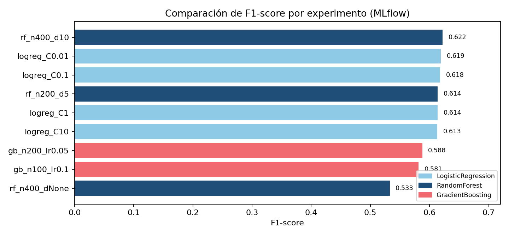
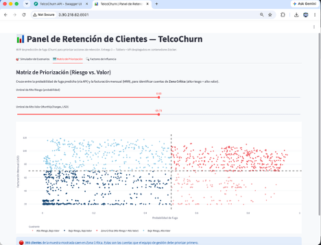
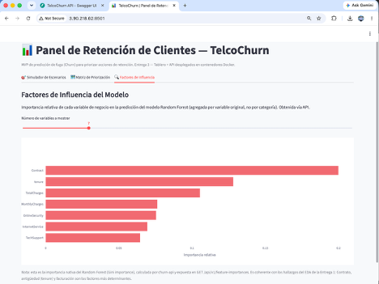
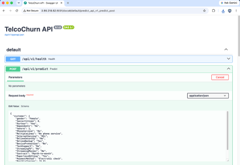
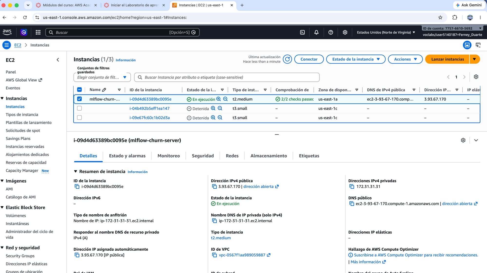
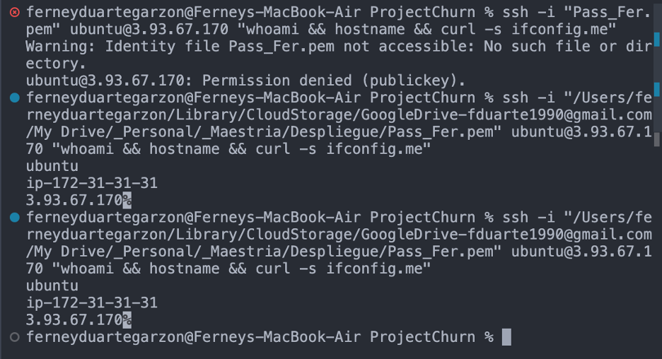
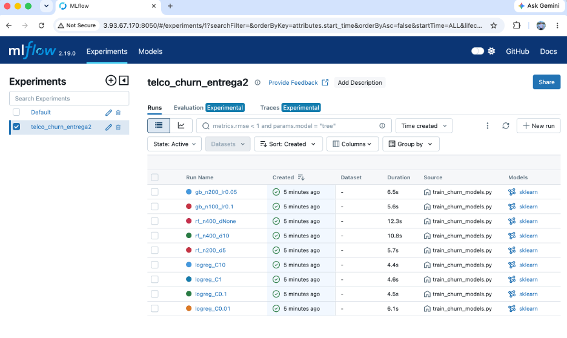
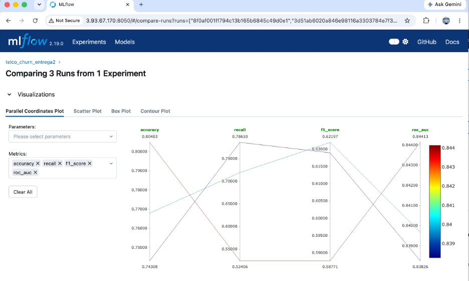

# TelcoChurn — Predicción de Fuga de Clientes

### Entrega Final · Despliegue de Soluciones Analíticas

**Equipo:** Ferney Duarte Garzón (202526327) · Andrés Mauricio Rueda Blanco (202524511)
**Repositorio:** github.com/fduarteg2/ProjectChurn

---

## 1. Resumen del problema

**Contexto.** En entornos B2B y de servicios recurrentes, retener un cliente cuesta significativamente menos que adquirir uno nuevo. Hoy los equipos de gestión de cuentas (Account Managers) operan de forma reactiva: se enteran de la insatisfacción del cliente cuando la cancelación ya fue decidida. Falta una herramienta analítica que identifique proactivamente qué cuentas están en riesgo, para priorizar el esfuerzo de retención hacia los clientes de mayor valor.

**Pregunta de negocio.** ¿Cuáles clientes presentan mayor probabilidad de cancelar su suscripción en el corto plazo y qué factores operativos influyen más en esa decisión, para focalizar las estrategias de retención?

**Alcance.** MVP funcional compuesto por: (i) modelado supervisado de clasificación binaria de fuga (Churn), con versionamiento de datos (DVC) y experimentos (MLflow); (ii) una **API** (FastAPI) que empaqueta el modelo y sirve las predicciones; (iii) un **tablero interactivo** (Streamlit) que consume la API — simulador de escenarios, matriz de priorización riesgo-valor y explicabilidad de factores; (iv) despliegue de ambos componentes en **contenedores Docker sobre una instancia AWS EC2**.

**Datos.** Telco Customer Churn (Kaggle): 7,043 clientes, 21 variables (20 predictoras + Churn) agrupadas en identificación, demografía, servicios contratados, y cuenta/pagos. Sin cambios respecto a la Entrega 2.

**Cambios respecto a la Entrega 2.** El alcance del modelo y del dataset no cambió. El cambio central de esta entrega es **arquitectónico**: hasta la Entrega 2 el tablero cargaba el modelo `.joblib` directamente; en esta entrega se separó esa responsabilidad en un servicio de API independiente (`churn-api`), y el tablero (`churn-tablero`) pasó a consumirla por HTTP. Ambos servicios se empaquetaron en contenedores Docker independientes, orquestados con `docker compose`, y se desplegaron en una instancia AWS EC2 dedicada.

## 2. Modelos desarrollados y su evaluación

*(Sin cambios respecto a la Entrega 2 — se reutiliza el mismo modelo y la misma evidencia de MLflow, ya que el alcance de modelado no varió para esta entrega.)*

**Preprocesamiento y selección de características.** Se descarta `customerID` (no aporta señal predictiva). `TotalCharges` se convierte a numérico e imputa como 0 en los 11 registros vacíos (clientes con `tenure=0`, sin facturación acumulada). Las 3 variables numéricas (`tenure`, `MonthlyCharges`, `TotalCharges`) se imputan por mediana y escalan (`StandardScaler`); las 16 variables categóricas se imputan por moda y codifican con `OneHotEncoder`, todo dentro de un `ColumnTransformer` encadenado en un `Pipeline` de scikit-learn. Split 80/20 estratificado por `Churn`, `random_state=42`.

**Experimentación con MLflow.** Se entrenaron 3 familias de modelos con distintas variaciones de hiperparámetros (9 corridas en total), cada una registrada como un *run* en MLflow con sus parámetros, métricas (accuracy, precision, recall, F1, ROC AUC), matriz de confusión y el modelo serializado como artefacto: Regresión Logística (`class_weight=balanced`, C ∈ {0.01, 0.1, 1, 10}), Random Forest (`class_weight=balanced`, 3 combinaciones de `n_estimators`/`max_depth`) y Gradient Boosting (2 combinaciones de `n_estimators`/`learning_rate`/`max_depth`).

{width=4.3in}

**Modelo seleccionado: `rf_n400_d10`** (Random Forest, 400 árboles, profundidad máxima 10, `class_weight=balanced`). Ofrece el mejor F1 (0.622) con el mejor equilibrio precision/recall del conjunto (precision 0.548, recall 0.719), y un ROC AUC competitivo (0.840), evitando el sobreajuste que exhibe la variante sin límite de profundidad (recall 0.468). Este modelo se re-entrena sobre el 100% de los datos (`train_final_model.py`) y se empaqueta como `modelo_churn_final.joblib`, artefacto que ahora consume **exclusivamente `churn-api`** (el tablero ya no lo carga).

## 3. Observaciones y conclusiones sobre los modelos

- La Regresión Logística (baseline) logra el mejor recall (~0.78-0.79) a costa de precisión baja (~0.50-0.51): útil como piso interpretable de referencia.
- Gradient Boosting obtiene la mayor accuracy/precisión (0.80/0.67) pero su recall cae a ~0.52 — subóptimo para este caso de negocio, donde no detectar a un cliente que se va (falso negativo) es más costoso que una alerta de más.
- Random Forest sin límite de profundidad sobreajusta (recall se desploma a 0.47), confirmando que restringir `max_depth` mejora la generalización.
- El modelo elegido (`rf_n400_d10`) prioriza capturar clientes en riesgo (recall 0.72) sin sacrificar demasiada precisión (0.55) — el balance más adecuado para un flujo de *triage* donde un Account Manager revisa manualmente la lista priorizada.
- La importancia de variables del modelo final confirma los hallazgos del EDA: `Contract`, `tenure`, `TotalCharges` y `MonthlyCharges` son los factores más determinantes (ver Figura de Factores de Influencia, sección 5), y esta explicabilidad ahora es servida por la API vía `GET /api/v1/feature-importances`.

## 4. Arquitectura de la solución (API + Tablero + Docker)

A partir de esta entrega, la solución se compone de dos servicios independientes, cada uno en su propio contenedor Docker:

- **`churn-api`** (FastAPI + Uvicorn, puerto 8001): empaqueta `modelo_churn_final.joblib` y expone:
  - `GET /api/v1/health` — estado del servicio y del modelo cargado.
  - `POST /api/v1/predict` — predicción de un cliente individual.
  - `POST /api/v1/predict_batch` — predicción de un lote de clientes (usada por la Matriz de Priorización).
  - `GET /api/v1/feature-importances` — importancia de variables del modelo (usada por Factores de Influencia).
- **`churn-tablero`** (Streamlit, puerto 8501): consume la API vía HTTP (variables de entorno `API_URL`/`API_PORT`) — ya no tiene acceso directo al modelo ni a `scikit-learn`.

Ambos servicios se definen en un único `docker-compose.yml`, que los conecta mediante la red interna de Docker (el tablero llama a `http://churn-api:8001`). Esto permite levantar toda la solución con dos comandos (`docker compose build && docker compose up -d`), documentados en el **Manual de Instalación** adjunto.

## 5. Descripción del tablero desarrollado y su funcionalidad

El tablero (`churn-tablero`, Streamlit) ofrece 3 vistas orientadas a la toma de decisiones del equipo de gestión de cuentas, todas alimentadas por la API en tiempo real:

**Simulador de Escenarios** — permite seleccionar un cliente base y modificar variables de negocio (contrato, soporte técnico, servicio de internet, método de pago) para observar el cambio en la probabilidad de fuga, calculada por `POST /api/v1/predict`.

{width=3.4in}

**Matriz de Priorización** — cruza la probabilidad de fuga (obtenida vía `POST /api/v1/predict_batch` sobre una muestra de clientes) contra la facturación mensual, para identificar la "Zona Crítica" (alto riesgo + alto valor).

{width=3.4in}

**Factores de Influencia** — importancia relativa de cada variable de negocio (Gini importance del Random Forest), obtenida vía `GET /api/v1/feature-importances`.

{width=3.4in}

## 6. Despliegue en la nube (IaaS — AWS EC2 + Docker)

La solución se desplegó en una instancia AWS EC2 dedicada (`churn-app-server`, Ubuntu 24.04, IP pública **3.90.218.62**), distinta de la instancia usada para MLflow (`mlflow-churn-server`), para no interferir con esa evidencia. En la instancia se instaló Docker, se clonó el repositorio, se regeneró el modelo empaquetado (`dvc pull` + `train_final_model.py`) y se levantaron ambos contenedores con `docker compose up -d`. El Security Group habilita los puertos 8001 (API) y 8501 (tablero) para acceso público.

**API en ejecución — documentación interactiva (Swagger UI) en `http://3.90.218.62:8001/docs`:**

{width=3.1in}
{width=3.1in}

Las capturas de la sección 5 (Simulador, Matriz, Factores) corresponden al tablero consumiendo esta misma API desplegada, ambas accesibles públicamente en las URLs indicadas, confirmando que el usuario puede interactuar con el modelo y explorar las visualizaciones desde la nube.

## 7. Repositorio y control de versiones

**Git / GitHub:** github.com/fduarteg2/ProjectChurn (repositorio público). Historial de commits con evolución del proyecto:

| Commit | Fecha | Autor | Descripción |
|---|---|---|---|
| 0b4aaac | 2026-07-20 | Ferney Duarte | Agrega API FastAPI (`churn-api`) y refactoriza el tablero para consumirla vía HTTP |
| a7f21a9 | 2026-07-20 | Ferney Duarte | Reorganiza carpeta `Entregas` por entrega e incluye guía de commits y soportes |
| 6dd5cd6 | 2026-07-11 | Andrés Rueda | Actualización README, reproducibilidad con DVC y MLflow |
| d044ef3 | 2026-07-11 | Andrés Rueda | Actualización IP e inclusión variante Gradient Boosting |
| 8ae6db3 | 2026-07-07 | Ferney Duarte | Actualiza IP de EC2 y agrega capturas de evidencia de MLflow |
| 94a6510 | 2026-07-07 | Ferney Duarte | Configura remoto DVC en S3 para compartir datos con el equipo |
| edb5438 | 2026-07-07 | Ferney Duarte | Agrega scripts de entrenamiento (MLflow) y PDFs de entregas |
| ebd1d13 | 2026-07-06 | Ferney Duarte | Agrega tablero interactivo (Streamlit) |
| 53fd02c / f480e44 | 2026-06-24 | Ferney Duarte | Ingesta de datos y configuración inicial de DVC |
| 25fa065 | 2026-06-24 | Ferney Duarte | EDA Project v1 (Entrega 1) |
| *(pendiente)* | *(pendiente)* | Andrés Rueda | Agrega endpoint `/api/v1/model-info` con metadatos del modelo |
| *(pendiente)* | *(pendiente)* | Andrés Rueda | Documenta la arquitectura API + tablero en el README |

### 7.1 Evidencia de aportes individuales en GitHub (Entrega 3)

La rúbrica exige evidencia individual del uso del repositorio por cada integrante del equipo. Los commits de Ferney Duarte para esta entrega se listan arriba (`0b4aaac`, `a7f21a9`). Los de Andrés Rueda quedan registrados con los dos commits señalados como *(pendiente)* en la tabla anterior.

> **ESPACIO PARA CAPTURA — Andrés Rueda.** Pegar aquí el pantallazo de `git log --oneline -5` o de `https://github.com/fduarteg2/ProjectChurn/commits/main` mostrando los 2 commits de la Entrega 3 a su nombre (guía enviada en `Guia_Andres_Entrega3.zip`). Al recibir la captura, actualizar también los hashes de commit en la tabla de la sección 7.

**DVC:** `Telco-Churn.csv` versionado y sincronizado en remoto S3 (`s3://projectchurn-dvc-fduarteg2`). Los artefactos generados (`modelo_churn_final.joblib`, `telco_churn_clean.csv`) se regeneran on-demand a partir del dataset versionado (ver Manual de Instalación), manteniendo el repositorio liviano y reproducible.

**Fuentes:**

- API: `churn-api/app/main.py`, `churn-api/app/api.py`, `churn-api/app/model.py`, `churn-api/app/schemas.py`
- Tablero: `churn-tablero/app/tablero.py`
- Entrenamiento (MLflow): `train_churn_models.py` · Entrenamiento del modelo final: `train_final_model.py`
- Despliegue: `churn-api/Dockerfile`, `churn-tablero/Dockerfile`, `docker-compose.yml`

## 8. Evidencia de experimentos en MLflow (AWS EC2)

*(Evidencia reutilizada de la Entrega 2 — mismos experimentos, sin cambios en esta entrega.)*

El servidor de MLflow se desplegó en una instancia AWS EC2 (IP pública 3.93.67.170, usuario `ubuntu`), donde se registraron las 9 corridas del experimento `telco_churn_entrega2`. Tras capturar la evidencia, el servicio de MLflow fue detenido; la instancia se mantiene activa sin terminar, conforme lo solicita el enunciado.

{width=3.1in}
{width=3.1in}

{width=3.1in}
{width=3.1in}

## 9. Principales resultados y conclusiones

- Se entregó un **prototipo funcional completo**: modelo supervisado empaquetado, servido por una API REST documentada (Swagger), y consumido por un tablero interactivo — todo desplegado en contenedores Docker sobre AWS EC2 y accesible públicamente.
- La separación API/tablero (nueva en esta entrega) desacopla el ciclo de vida del modelo del de la interfaz: el modelo puede actualizarse y volver a desplegarse sin tocar el tablero, y viceversa — una arquitectura más cercana a un escenario de producción real.
- El modelo seleccionado (Random Forest, recall 0.72 / precisión 0.55) sostiene el caso de negocio: prioriza automáticamente a los clientes en Zona Crítica (alto riesgo + alto valor), habilitando el *triage* proactivo que motivó el proyecto.
- Los factores más determinantes (`Contract`, `tenure`, `TotalCharges`) son consistentes entre el EDA inicial, el modelo y la Entrega 2 — reforzando la confiabilidad de las recomendaciones del sistema.
- **Trabajo futuro:** autenticación en la API, monitoreo de *drift* del modelo en producción, y un pipeline de CI/CD (build → test → deploy) que dispare automáticamente un nuevo despliegue ante cada actualización del modelo o del tablero.

---

*Documentos adjuntos a esta entrega: Manual de Usuario del Tablero, Manual de Instalación, y Reporte de Trabajo en Equipo.*
